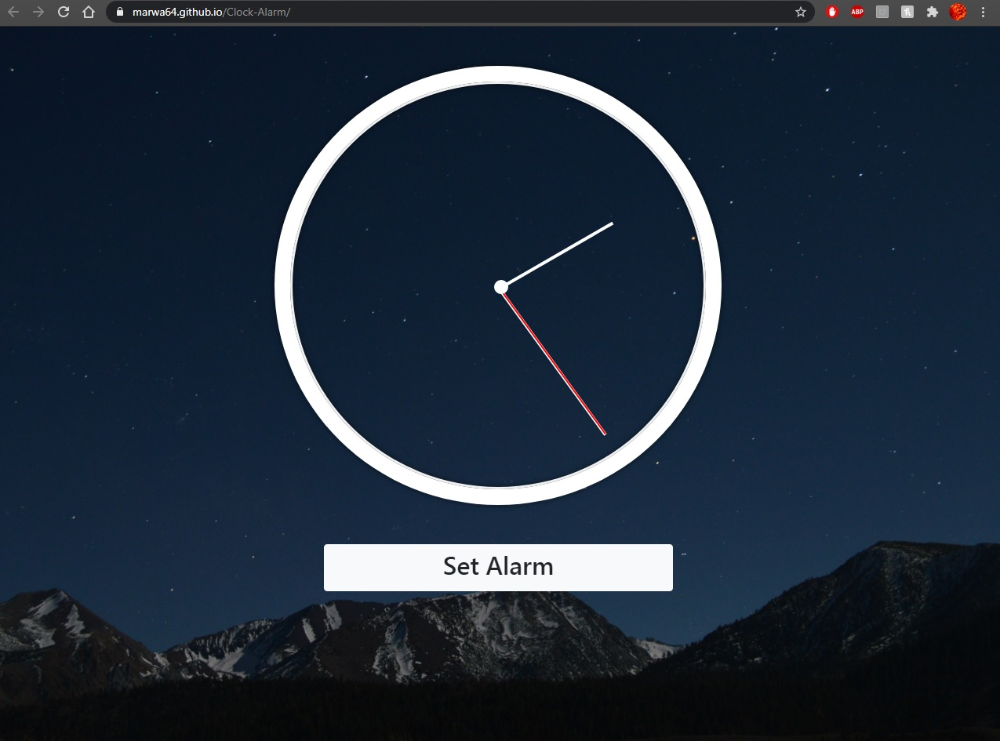
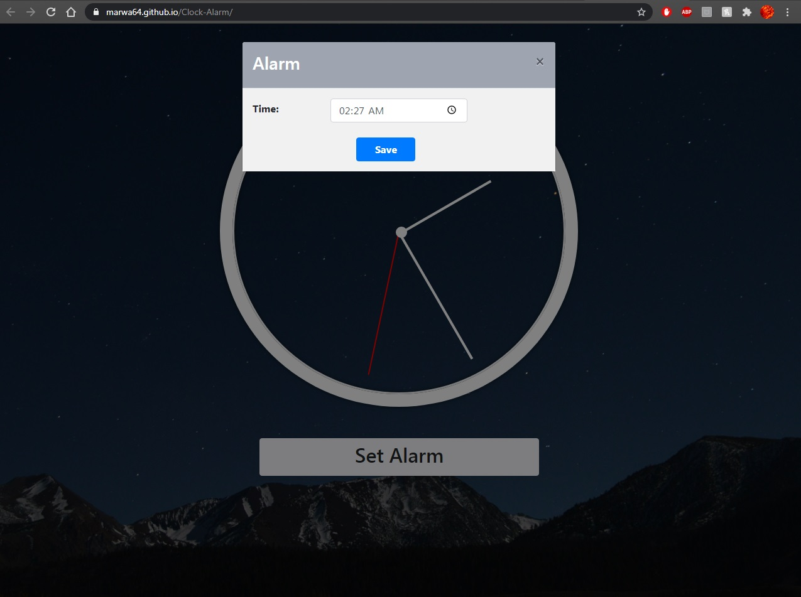
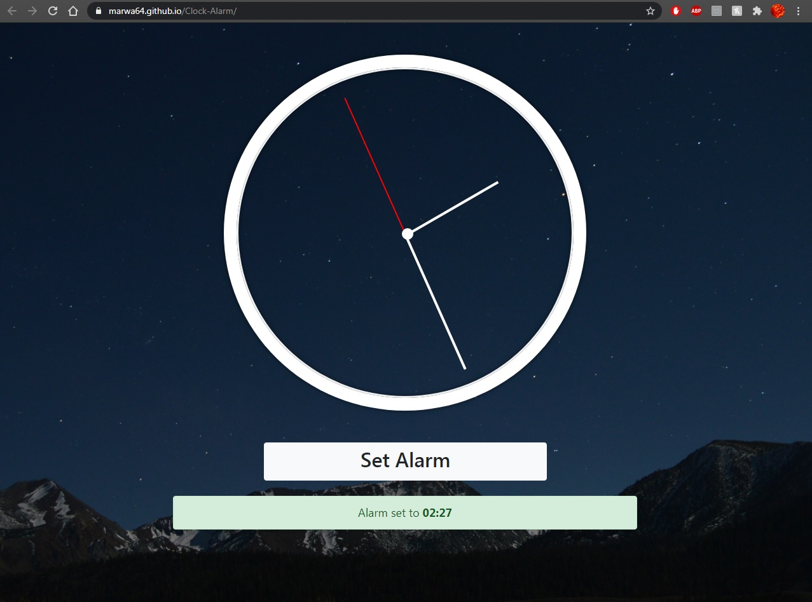

# Clock-Alarm
A clock made with html/scss/javascript in which you can also set up an alarm to ring at a certain time. 
The sound used when the alarm rings is made using one of my other projects <b>DrumKit</b>  
Liver Version: https://marwa64.github.io/Clock-Alarm/

<h3>Screenshots</h3>
  
  
   
